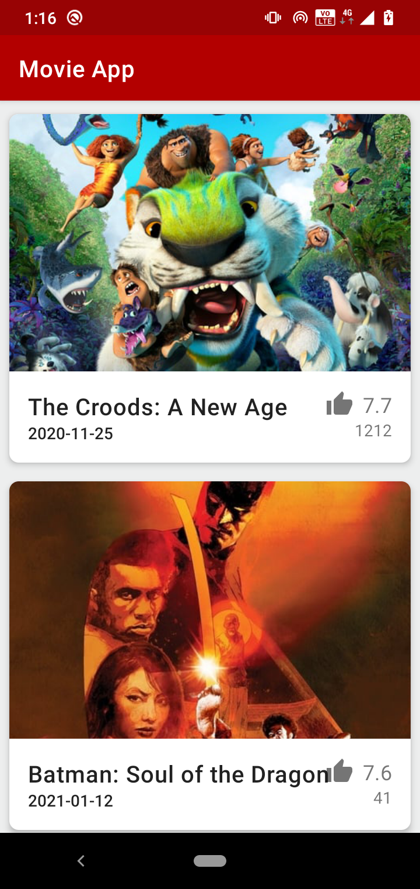

# Movie App
This is a movie app that follows MVVM architecture design pattern and uses android Jetpack components.

### Libraries Used

* Room 
* ViewModel
* Lifecycle
* LiveData
* Retrofit
* Glide 
* RecyclerView
* CardView

### Screenshots

